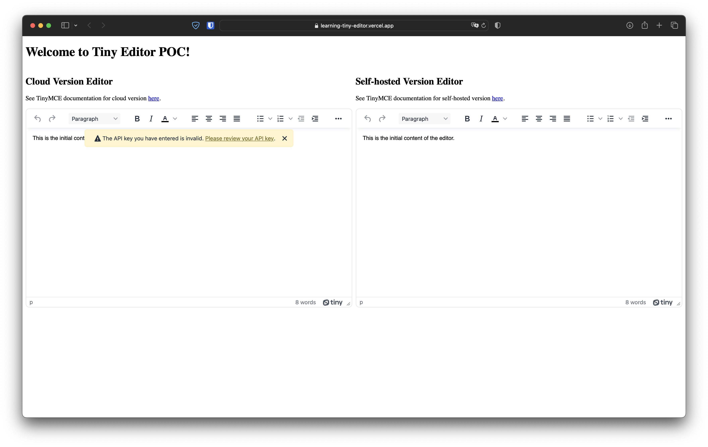

# Starting with TinyMCE

TinyMCE is a rich-text editor that allows users to create formatted content within a user-friendly interface.

The output created is in HTML5 and can include lists, tables, and other useful elements, depending on your configuration. The functionality of the editor can be extended through plugins and customizations, or limited to suit your use-case. TinyMCE can also be customized to look and feel like part of your application or webpage by customizing the user interface. TinyMCE can be integrated into a range of frameworks and Content Management Systems (CMSs), and can be either:

- Loaded from the Tiny Cloud CDN (Content Delivery Network), which will ensure TinyMCE is always using the latest version
- Installed with a package manager (self-hosted)
- Extracted from a .zip file (self-hosted)

## Table of Contents

- [Introduction](#introduction)
- [Installation](#installation)
- [Usage](#usage)
- [Contributing](#contributing)

## Introduction



This project implements 3 versions from TinyMCE:

- Cloud Version (client-side renderer)
- Self-hosted Version (client-side renderer)
- Self-hosted Version (server-side renderer)

The 2 client-side renderer versions uses a simple React app and the server-side renderer version uses a default Express app.

## Installation

### Client-side renderer versions

```
cd web
yarn install
```

For client-side renderer with self-hosted editor, we need to sync tinymce folder from node_modules to public folder. But don't worry, if postinstall script works as it should you don't need to do anything... you're safe!

### Server-side renderer version

```
cd api
yarn install
```

Thats it!

## Usage

### Client-side renderer versions

```
cd web
yarn dev
```

### Server-side renderer version

```
cd api
yarn dev
```

## Contributing

Thank you for considering contributing to this project! Contributions are highly appreciated. Make your changes and aubmit a pull request to the main repository (please describing your changes in detail).
